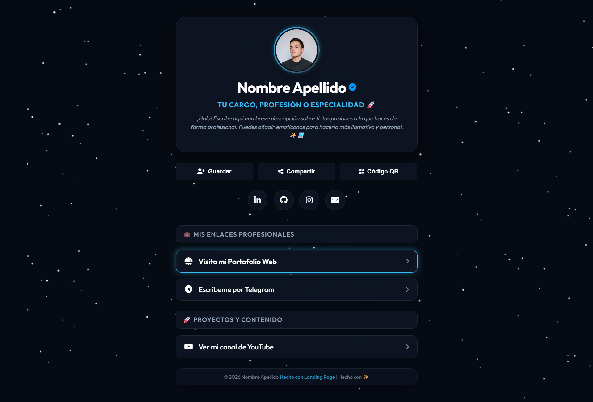
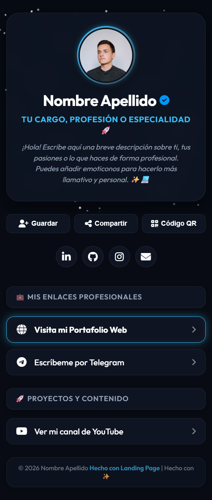
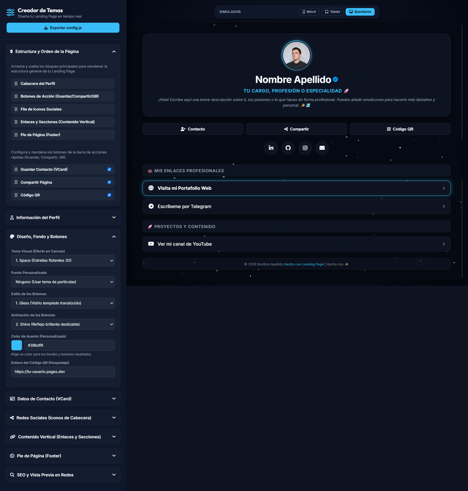
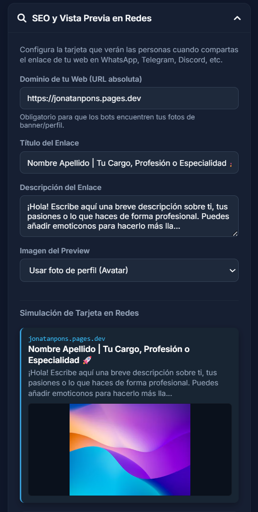

# 🌟 Premium Biolink & Interactive Landing Page


Una landing page premium, ultra-rápida y altamente interactiva para tus enlaces personales o profesionales. Diseñada como una alternativa moderna y autohospedada a Linktree o LinkStack, pensada para lucir espectacular y funcionar en cualquier servidor estático gratuito.

🚀 **Demostración en Vivo**: [premium-biolink-landing.pages.dev](https://premium-biolink-landing.pages.dev)  
🎨 **Creador de Temas Online**: [premium-biolink-landing.pages.dev/theme-creator/](https://premium-biolink-landing.pages.dev/theme-creator/)

---

## 📸 Vista Previa del Proyecto

| 💻 Vista de Escritorio | 📱 Vista Móvil |
| :---: | :---: |
|  |  |

---

## ✨ Características Principales

*   🎨 **20 Temas Visuales Interactivos**: Efectos de fondo en vivo usando Canvas de HTML5 (campos de estrellas, auroras polares, lluvia digital tipo Matrix, cuadrícula Synthwave, luciérnagas, pétalos de cerezo y más).
*   🛠️ **Creador de Temas Integrado**: Panel visual interactivo en el subdirectorio `/theme-creator` para personalizar colores de acento, estilos de botones, animaciones, ordenar secciones mediante arrastrar y soltar (Drag & Drop), y ajustar opciones de navegador. Exporta tu configuración al instante.
*   🌐 **Personalización del Navegador (Favicon y Título)**: Elige el favicon de tu pestaña desde el creador (usando tu foto de perfil, cualquier icono de FontAwesome 6 o una ruta de imagen personalizada) y configura un título personalizado para el navegador sin editar `index.html`.
*   📱 **Instalación como Aplicación Nativa (PWA)**: Opción para habilitar Progressive Web App desde la configuración. Tu web podrá ser instalada con un solo clic como aplicación móvil (iOS/Android) u ordenador (Windows/macOS/Linux), con soporte offline gracias a su Service Worker integrado.
*   🔍 **Simulador SEO y Open Graph (Redes Sociales)**: Previsualiza en tiempo real cómo se verá la burbuja de compartido de tu web en WhatsApp, Telegram o Discord. Elige entre mostrar tu avatar, banner, un código QR autogenerado o ninguno, y copia el código meta estático listo para usar.
*   📇 **Descarga de Tarjeta de Contacto (VCard)**: Botón interactivo para añadir tu información de contacto directamente a la agenda del móvil del visitante.
*   ⚡ **Rendimiento Máximo**: Construida únicamente con HTML, CSS vainilla y JavaScript estático. Sin bases de datos, sin dependencias pesadas y con carga instantánea.

---

### 🛠️ Panel del Creador de Temas y Simulador SEO

| 🎨 Personalización del Tema | 🔍 Simulador Open Graph |
| :---: | :---: |
|  |  |

---

## 🚀 Despliegue en 1 Clic (1-Click Deploy)

Puedes desplegar este proyecto gratis en cuestión de segundos utilizando cualquiera de estas dos plataformas autohospedadas:

| ☁️ Cloudflare Pages (Automático) | 🐙 GitHub Pages (2 Clics) |
| :---: | :---: |
| [](https://deploy.workers.cloudflare.com/?url=https://github.com/thanatos84/premium-biolink-landing) | [](https://github.com/thanatos84/premium-biolink-landing/settings/pages) |

*   **Cloudflare Pages**: Hace una copia (fork) del proyecto en tu cuenta de GitHub y lo compila/publica automáticamente.
*   **GitHub Pages**: Haz clic en el botón de arriba para ir directo a la sección de configuración de tu repositorio, selecciona la rama `main` en el apartado **Branch**, pulsa **Save** y tu web estará lista en segundos.

---

## 🚀 Inicio Rápido Local (Quick Start)

### 1. Clonar el repositorio
Descarga el código del proyecto en tu ordenador:
```bash
git clone https://github.com/thanatos84/premium-biolink-landing.git
cd premium-biolink-landing
```

### 2. Configurar tus datos
Tienes dos opciones para personalizar la página con tus enlaces y estilo:
*   **Método Visual (Recomendado)**: Abre el archivo `theme-creator/index.html` en tu navegador web. Edita la biografía, enlaces, redes e iconos desde el panel. Al finalizar, haz clic en **"Exportar config.js"** y reemplaza el archivo `config.js` de la raíz del proyecto por el descargado.
*   **Método Directo**: Abre el archivo `config.js` en tu editor de código preferido (VS Code, Bloc de Notas, etc.) y modifica directamente los textos y enlaces de la estructura.

### 3. Subir a tu Hosting Manualmente
Si prefieres no usar el botón automático, puedes subir la carpeta del proyecto a cualquier hosting de archivos estáticos. Recomendamos **Cloudflare Pages** o **GitHub Pages** por su velocidad y gratuidad ilimitada.

---

## 📖 Guía Completa de Usuario
¿Quieres saber cómo registrar un subdominio gratuito (`.pp.ua`, `is-a.dev`, `js.org`, etc.), cómo conectar tus DNS con o sin Cloudflare, o cómo estructurar iconos avanzados y etiquetas HTML libres?

*   📖 **[Manual de Usuario en Formato Markdown (GitHub)](TUTORIAL.md)**
*   🌐 **[Manual Interactivo y Wiki en Formato Web](https://premium-biolink-landing.pages.dev/manual.html)**

---

## ⚖️ Licencia
Este proyecto está bajo la Licencia **MIT**. Puedes usarlo, modificarlo y distribuirlo libremente para fines personales o comerciales.
