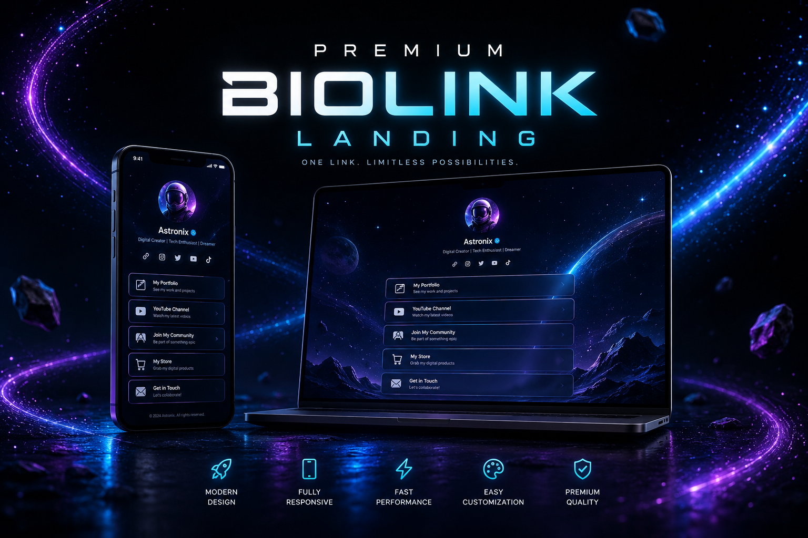
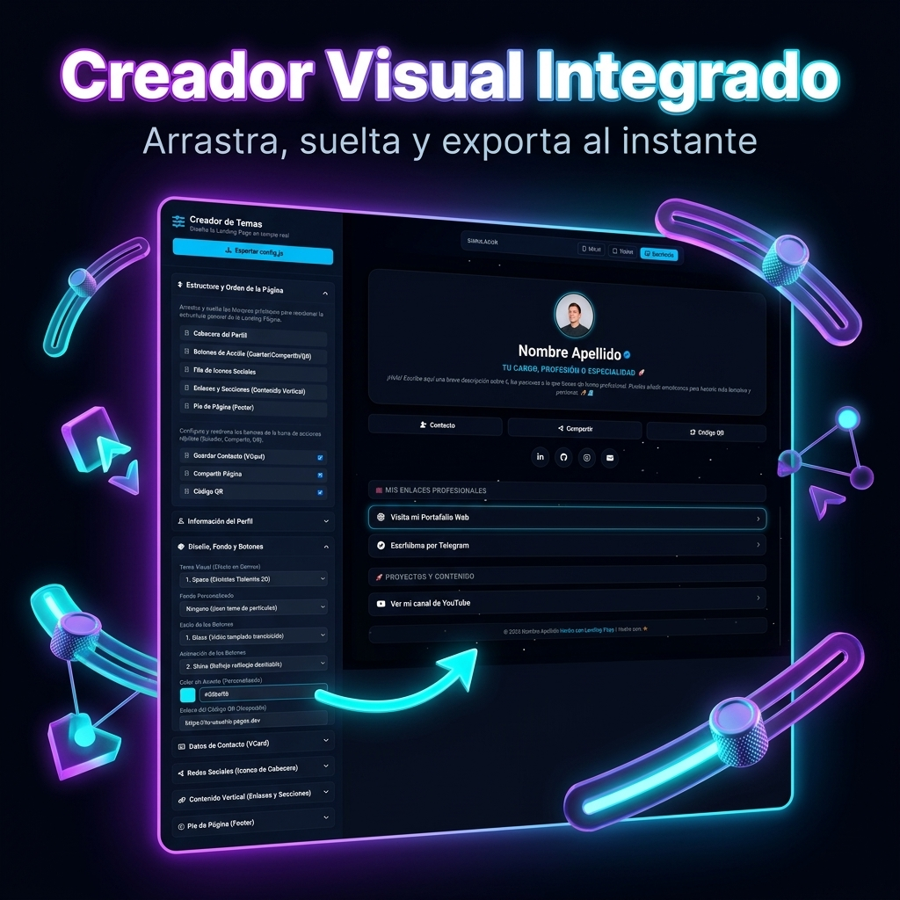
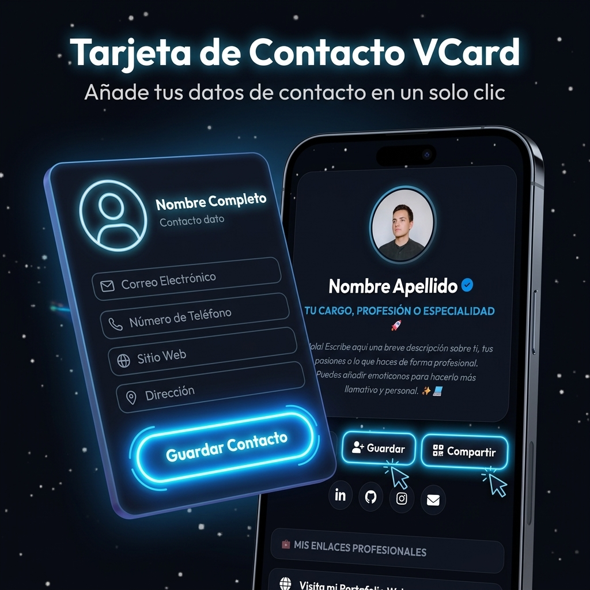
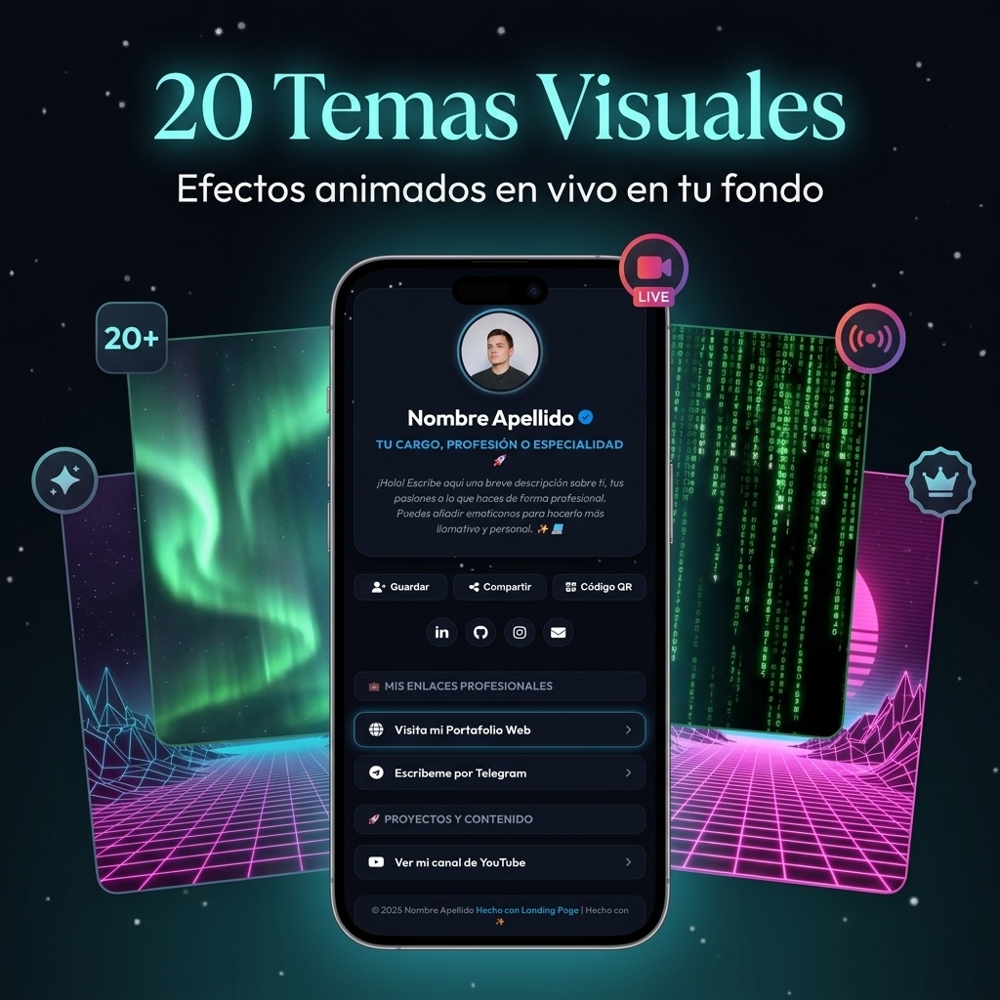
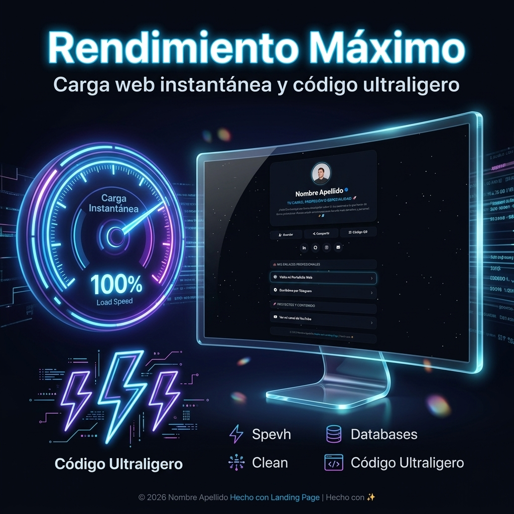
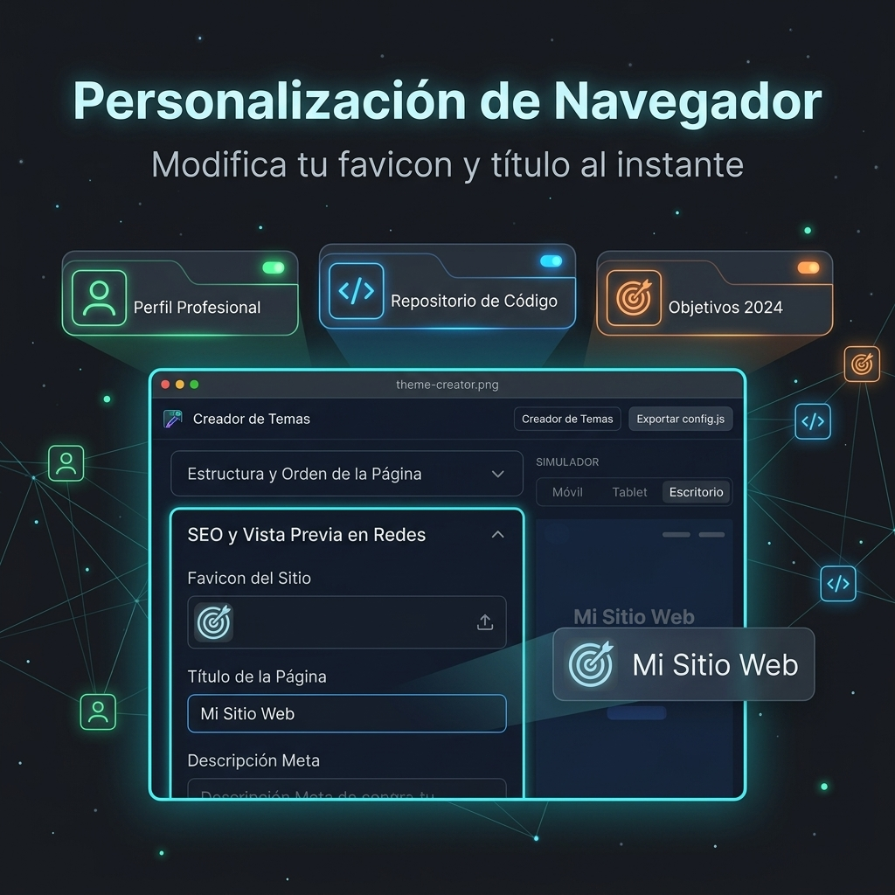
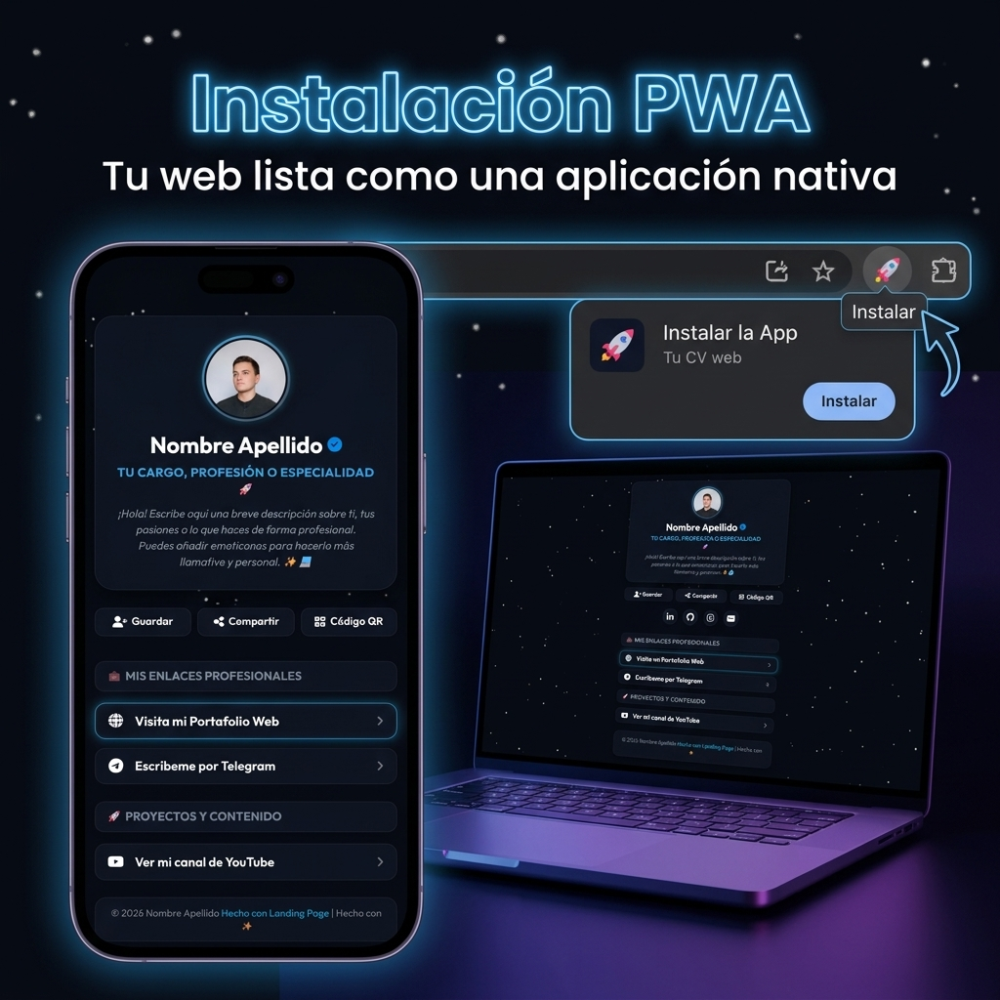

# Wiki & Manual de Usuario Completo - Landing Page Premium



Bienvenido a la guía oficial de referencia. Este documento contiene todas las instrucciones paso a paso para utilizar, personalizar, hospedar y configurar un subdominio gratuito en tu Landing Page, diseñado de forma comprensible para cualquier persona sin conocimientos técnicos previos.

🚀 **Demostración en Vivo**: [premium-biolink-landing.pages.dev](https://premium-biolink-landing.pages.dev)  
🎨 **Creador de Temas Online**: [premium-biolink-landing.pages.dev/theme-creator/](https://premium-biolink-landing.pages.dev/theme-creator/)

---

## 📖 Contenidos
1. [Glosario de Términos (Conceptos Básicos)](#1-glosario-de-términos-conceptos-básicos)
2. [Uso de la Web Principal](#2-uso-de-la-web-principal)
3. [Estructura de Archivos del Proyecto](#3-estructura-de-archivos-del-proyecto)
4. [Guía del Creador de Temas](#4-guía-del-creador-de-temas)
5. [Opciones de Configuración del Creador](#5-opciones-de-configuración-del-creador)
6. [Carga de Recursos Multimedia (Imágenes y Videos)](#6-carga-de-recursos-multimedia-imágenes-y-videos)
7. [Sistema Flexible de Iconos (FontAwesome)](#7-sistema-flexible-de-iconos-fontawesome)
8. [Soporte de Etiquetas HTML Libres](#8-soporte-de-etiquetas-html-libres)
9. [Cómo añadir Temas, Botones y Efectos (Desarrolladores)](#9-cómo-añadir-temas-botones-y-efectos-desarrolladores)
10. [Hosting Gratuito (Alojamiento de tu Web)](#10-hosting-gratuito-alojamiento-de-tu-web)
11. [Proveedores de Subdominios Gratuitos](#11-proveedores-de-subdominios-gratuitos)
12. [Cómo Conectar tu Subdominio a tu Hosting (DNS)](#12-cómo-conectar-tu-subdominio-a-tu-hosting-dns)
13. [SEO, Meta Tags y Vista Previa al Compartir (Open Graph)](#13-seo-meta-tags-y-vista-previa-al-compartir-open-graph)
14. [Configuración Avanzada de la Web (Favicon, Título y App Instalable)](#14-configuración-avanzada-de-la-web-favicon-título-y-app-instalable)
15. [Preguntas Frecuentes y Solución de Problemas (FAQ)](#15-preguntas-frecuentes-y-solución-de-problemas-faq)

---

## 1. Glosario de Términos (Conceptos Básicos)
Si es tu primera vez creando una página web, estos conceptos te ayudarán a comprender todo el proceso sin tecnicismos complejos:

*   **Hosting (Alojamiento)**: Es como un "disco duro" conectado a internet las 24 horas del día. Allí es donde guardas los archivos de tu web (como `index.html`, `app.js`, etc.) para que otros puedan acceder a ellos.
*   **Dominio**: Tu nombre único en internet (ejemplo: `miweb.com`).
*   **Subdominio**: Un nombre añadido antes de tu dominio principal separado por un punto (ejemplo: `tu-usuario.is-a.dev` o `tu-dominio.pp.ua`). Son ideales porque muchos proveedores los ofrecen 100% gratis.
*   **DNS (Dirección DNS)**: Funciona como la agenda telefónica de internet. Traduce el nombre de tu web (como `tu-usuario.is-a.dev`) en la dirección numérica (IP) del ordenador donde está alojada tu web.
*   **Registro CNAME**: Una instrucción DNS específica que dice: *"Cuando alguien busque mi subdominio A, llévalo a la dirección del hosting B"* (ejemplo: apunta `tu-usuario.is-a.dev` a `tuusuario.github.io`).
*   **Nameservers (Servidores de nombres)**: Son las computadoras encargadas de gestionar las DNS de tu dominio. Al cambiarlos, le otorgas el control de tus DNS a otra plataforma (como Cloudflare).

---

## 2. Uso de la Web Principal
Tu Landing Page está optimizada con un diseño visual interactivo, responsivo y adaptado para móviles (Mobile-First) con efectos de neón y translúcidos (glassmorphism).

*   **Banner Superior**: Cubre el 100% de la pantalla horizontalmente con una imagen o vídeo continuo. Si decides no configurarlo, la cabecera se adapta de forma fluida.
*   **Avatar**: Foto o vídeo de perfil personalizable con formas geométricas dinámicas (corazón, hexágono, etc.) y un deslizador de tamaño para regular su escala.
*   **Cabecera**: Muestra tu nombre, insignia de verificado opcional, título profesional y tu biografía.
*   **Enlaces y Secciones**: Bloques organizados donde colocar tus enlaces externos con animaciones hover y efectos continuos de destacado.

---

## 3. Estructura de Archivos del Proyecto
Para entender cómo funciona la Landing Page, aquí tienes la explicación sencilla de para qué sirve cada archivo en tu directorio raíz:

1.  **`index.html`**: El esqueleto de tu web. Contiene las divisiones principales donde irán inyectados tus datos. No necesitas editar este archivo manualmente.
2.  **`index.css`**: Las reglas de diseño. Define la paleta de colores de tus temas, el efecto de difuminado y cristal templado (glassmorphism) de las cajas y la forma de los avatares.
3.  **`app.js`**: El cerebro activo de tu landing. Lee tu archivo de datos `config.js` y renderiza el perfil en pantalla, tus enlaces en tiempo real y ejecuta los fondos animados de Canvas.
4.  **`config.js`**: La base de datos de tu landing. Guarda de forma estructurada toda tu biografía, los enlaces, nombres de imágenes y personalización del tema. Este archivo se sobreescribe cuando descargas tus cambios desde el creador.
5.  **`theme-creator/`**: Carpeta que contiene la aplicación editora visual. No forma parte de la web final, sino que te sirve localmente para construir tu tema de forma interactiva y descargar tu `config.js`.

---

## 4. Guía del Creador de Temas



El creador es una aplicación web interactiva (ubicada en `/theme-creator/index.html`) que te permite diseñar la web de forma visual y sin escribir código.

1.  **Edición en Vivo**: El panel izquierdo te permite modificar nombres, temas, colores, formas y enlaces, y ver el resultado de inmediato en la simulación del teléfono del panel derecho.
2.  **Gestión de Enlaces (Drag & Drop)**: Puedes arrastrar y soltar los bloques de enlaces en el creador para ordenarlos de arriba a abajo.
3.  **Separadores Transparentes**: Puedes añadir espaciadores invisibles y configurar su altura exacta mediante una barra deslizadora para separar secciones muy juntas.
4.  **Exportación**: Una vez termines de editar, haz clic en **"Exportar config.js"**. Descargará un archivo que deberás mover a la carpeta raíz de tu proyecto reemplazando el archivo `config.js` original para aplicar los cambios a la web definitiva.

---

## 5. Opciones de Configuración del Creador



El editor visual cuenta con una amplia variedad de controles interactivos para regular la distribución visual (layout) de tu Landing Page:

### A. Datos Generales y Avatar (Foto/Video)
*   **Nombre Completo**: Tu nombre o marca personal (soporta código HTML).
*   **Insignia Verificado**: Muestra un check de verificación azul junto a tu nombre.
*   **Título Profesional**: Tu cargo actual (ej: `<b>Desarrollador</b>`).
*   **Foto de Perfil (Avatar) - Tipo Imagen o Video**: Puedes seleccionar una foto tradicional (`profile.jpg`) o un archivo de video local en formato MP4 (ej: `avatar-animado.mp4`). El video se reproducirá en un clip silenciado continuo.
*   **Forma del Avatar**: 9 formas a elegir mediante recorte de máscara (Círculo, Cuadrado, Cuadrado Redondeado, Triángulo, Hexágono, Octágono, Rombo, Corazón y Estrella).
*   **Tamaño del Avatar**: Deslizador interactivo para configurar el tamaño exacto del avatar en píxeles (de 60px a 160px) de forma fluida.

### B. Banner/Cabecera Superior
*   **Mostrar Banner**: Activa o desactiva la cabecera. Si no se activa, la interfaz de perfil sube para no dejar huecos en blanco.
*   **Tipo de Banner**: Elige si el fondo será una imagen fija o un video MP4/WebM local en bucle.
*   **URL o Nombre**: Permite ingresar nombres de archivos locales (ej: `banner.mp4`) o enlaces web.

### C. Layouts de la "Caja de Lectura" (Efecto Glassmorphism)
Puedes configurar la apariencia translúcida de la cabecera e individualizar las secciones:
*   **Caja en toda la Cabecera**: Envuelve todo el perfil (avatar, nombre, título, bio completa) bajo una sola tarjeta unificada.
*   **Caja en toda la Biografía**: Envuelve únicamente la biografía, dejando tu nombre y avatar flotando libres en el fondo.
*   **Caja por Párrafo Individual**: Permite decidir por cada párrafo de la biografía si cuenta con su propio marco translúcido individualizado.
*   **Caja en Secciones**: Agrupa todos los enlaces y títulos de secciones bajo una sola gran tarjeta de lectura.
*   **Deslizador de Color y Opacidad**: Permite afinar el color hexadecimal exacto de las cajas y regular su opacidad (transparencia de 0 a 1) para coordinar con el tema.

### D. Elementos del Contenido
*   **Enlaces**: Inputs para título, dirección URL, icono específico y checkbox de "Destacar" (aplica animaciones hover continuas para captar clics).
*   **Títulos de Sección**: Sirven de separadores para agrupar enlaces. Tienen un interruptor para forzar que tengan caja o que se integren transparentes en el tema.
*   **Separadores**: Elementos transparentes cuya altura puedes regular de 5px a 100px para separar bloques muy pegados.

---

## 6. Carga de Recursos Multimedia (Imágenes y Videos)
Tanto para la **Foto de Perfil** (avatar) como para el **Banner de Cabecera**, tienes dos formas de configurarlos en la interfaz:

### A. Archivos Locales (Recomendado)
Guarda la imagen (PNG, JPG, SVG, GIF) o video (MP4, WebM) dentro de la carpeta raíz del proyecto (donde está `index.html`). En el input del Creador de Temas simplemente escribe el **nombre exacto del archivo con su extensión**.
*   *Ejemplo para perfil:* `profile.jpg` o `video-avatar.mp4`
*   *Ejemplo para banner:* `banner.mp4` o `cabecera.jpg`

### B. URLs Remotas / Externas
Si deseas utilizar imágenes de internet (Imgur, Discord, Unsplash, etc.), introduce la URL directa completa.
*   *Ejemplo:* `https://images.unsplash.com/photo-1579546929518-9e396f3cc809`

---

## 7. Uso de Iconos Flexibles (FontAwesome)
El proyecto incluye la biblioteca de iconos vectoriales **FontAwesome v6**. El campo "Icono" en tus enlaces o secciones es inteligente y soporta múltiples formatos.

### A. ¿Cómo busca e interpreta el código los iconos?
La función interna `getIconHtml()` en `app.js` y `creator.js` analiza el texto introducido en el campo de icono:
1.  **Detección de Imagen**: Si el texto inicia con `http://`, `https://` o `./`, interpreta que es una ruta de imagen y genera una etiqueta ``.
2.  **Detección de Clase FontAwesome**: Si el texto contiene el prefijo `fa-` o contiene palabras clave de librerías como `fab `, `fas `, `far `, `fa `, asume que es una clase y dibuja el icono de forma nativa.
3.  **Mapa de Alias Interno**: Si escribes un nombre simple en minúsculas (ej: `whatsapp`, `github`, `linkedin`, `mail`), el sistema consulta un diccionario interno (`ICON_MAP`) para buscar su traducción en clase de icono.
4.  **Fallback**: Si no cumple con ninguno de los puntos anteriores, el sistema intenta añadir el prefijo por defecto `fas fa-` seguido del texto ingresado.

### B. Diferencia entre formatos
*   `whatsapp`: Traduce a la clase `fab fa-whatsapp` automáticamente mediante el mapa interno de alias.
*   `fa-brands fa-whatsapp` o `fab fa-whatsapp`: Carga el icono directamente utilizando clases puras de FontAwesome (ideal si deseas usar iconos específicos que no están en el diccionario).
*   `<i class="fa-brands fa-whatsapp"></i>`: **No debes escribir esto en el input "Icono"**. Esta etiqueta HTML completa de FontAwesome se utiliza únicamente dentro de textos libres como tu biografía o descripciones.

### C. Buscar Iconos Nuevos
Entra al sitio oficial de [FontAwesome Icons](https://fontawesome.com/icons) y busca el icono gratuito que desees. Copia el nombre de la clase (ej: `fa-brands fa-tiktok` o `fa-solid fa-envelope`) y pégalo directamente en el creador.

---

## 8. Uso de Etiquetas HTML Libres
Los campos del proyecto son compatibles con código HTML nativo para dar la máxima flexibilidad de diseño a tus textos. Puedes utilizar estas etiquetas en la **Biografía**, el **Título Profesional**, los **Títulos de Secciones** y de **Enlaces**:

- **Negritas**: `<b>Texto</b>` o `<strong>Texto</strong>` (Ej: `<b>Juan</b>`)
- **Cursiva**: `<i>Texto</i>` o `<em>Texto</em>` (Ej: `<i>Diseñador</i>`)
- **Subrayado**: `<u>Texto</u>`
- **Tachado**: `<s>Tachado</s>` o `<del>Tachado</del>`
- **Salto de Línea**: `<br>`
- **Estilos de Color o Tamaños**: `<span style="color: #3b82f6; font-weight: bold;">Mi texto azul</span>`
- **Icono FontAwesome incrustado**: `Contáctame aquí <i class="fa-brands fa-telegram"></i>`

---

## 9. Cómo añadir Temas, Botones y Efectos (Desarrolladores)

Si deseas expandir la programación de la landing, puedes crear nuevos diseños modificando el código fuente del proyecto:

### A. Crear un nuevo Tema Visual



1.  **CSS**: Abre `index.css` y define las variables de color en `body.theme-mituema`:
    ```css
    body.theme-volcano {
      --bg-color: #0b0200;
      --text-muted: #f87171;
      --accent-color: #f97316;
      --accent-glow: rgba(249, 115, 22, 0.4);
      --glass-bg: rgba(30, 8, 4, 0.8);
      --glass-border: rgba(249, 115, 22, 0.15);
      background: radial-gradient(circle at center, #2e0802 0%, #0b0200 100%) !important;
    }
    ```
2.  **Partículas en Canvas**: Abre `app.js` y busca `initBackgroundAnimation()`. Inicializa y dibuja las partículas asociadas a tu tema en el canvas:
    ```javascript
    else if (theme === "volcano") {
      numParticles = 50;
      for (let i = 0; i < numParticles; i++) {
        particles.push({
          x: Math.random() * width,
          y: Math.random() * height,
          size: Math.random() * 4 + 1,
          speedY: -(Math.random() * 0.4 + 0.1),
          alpha: Math.random() * 0.7 + 0.2
        });
      }
    }
    ```
    Y en el bucle `draw()`:
    ```javascript
    else if (theme === "volcano") {
      ctx.fillStyle = "rgba(11, 2, 0, 0.25)";
      ctx.fillRect(0, 0, width, height);
      particles.forEach((p) => {
        p.y += p.speedY;
        if (p.y < -20) { p.y = height + 20; p.x = Math.random() * width; }
        ctx.beginPath();
        ctx.arc(p.x + mouseX * p.size * 0.3, p.y + mouseY * p.size * 0.3, p.size, 0, Math.PI * 2);
        ctx.fillStyle = `rgba(249, 115, 22, ${p.alpha})`;
        ctx.fill();
      });
    }
    ```
    *Nota: Repite exactamente esta configuración de partículas en `theme-creator/creator.js` (en `initPreviewAnimation()`) para que también se anime en la vista previa del simulador.*
3.  **HTML**: En `theme-creator/index.html`, añade la opción en el selector `<select id="select-theme">`.

### B. Crear un nuevo Estilo de Botón
1.  **CSS**: Añade en `index.css` el diseño para el botón:
    ```css
    .btn-style-neon-doble {
      background: transparent;
      border: 2px solid var(--accent-color);
      box-shadow: 0 0 5px var(--accent-color);
    }
    .btn-style-neon-doble:hover {
      background: var(--accent-glow);
    }
    ```
2.  **HTML**: En `theme-creator/index.html`, añade la opción en `<select id="select-button-style">`.

### C. Crear una nueva Animación de Botón
1.  **CSS**: Define una animación CSS en `index.css`:
    ```css
    .btn-anim-shake-fast {
      animation: shake 1.5s infinite;
    }
    @keyframes shake {
      0%, 100% { transform: translateX(0); }
      25% { transform: translateX(-3px); }
      75% { transform: translateX(3px); }
    }
    ```
2.  **HTML**: Regístralo en `<select id="select-button-anim">` de `theme-creator/index.html`.

---

## 10. Hosting Gratuito (Alojamiento de tu Web)



Cuando tengas lista la web y tu archivo `config.js` actualizado, puedes hospedarla gratuitamente usando cualquiera de estos proveedores de hosting estático:

### A. GitHub Pages ([pages.github.com](https://pages.github.com/))
GitHub ofrece alojamiento web estático ilimitado gratis:
1.  Crea una cuenta gratuita en [GitHub.com](https://github.com).
2.  Haz clic en el botón **"+"** (arriba a la derecha) -> **New repository**.
3.  Asígnale a tu repositorio el nombre exacto: `tuusuario.github.io` (sustituye "tuusuario" por tu nombre real de usuario de GitHub). Configúralo como **Public**.
4.  Entra en tu nuevo repositorio, haz clic en **"uploading an existing file"** y arrastra todos los archivos de tu proyecto (incluyendo `index.html`, `app.js`, `index.css`, `config.js` y tus fotos/videos locales).
5.  Haz clic en el botón verde **"Commit changes"** abajo del todo. Tu web estará visible en minutos en `https://tuusuario.github.io`.

### B. Cloudflare Pages ([pages.cloudflare.com](https://pages.cloudflare.com/))
Una plataforma hiperveloz que ofrece ancho de banda ilimitado, protección gratuita contra hackers y una de las redes más rápidas de Internet:
1.  Regístrate de forma gratuita en [dash.cloudflare.com/sign-up](https://dash.cloudflare.com/sign-up).
2.  Ve al menú lateral izquierdo -> **Workers & Pages** -> pestaña **Pages** -> pulsa en **Create an Application** -> **Upload assets**.
3.  Introduce un nombre para tu proyecto y arrastra la carpeta completa de tu proyecto al recuadro de subida.
4.  Haz clic en **Deploy Site**. Cloudflare te dará una dirección gratuita terminada en `*.pages.dev`.

### C. Surge.sh ([surge.sh](https://surge.sh/))
Publica tu web en segundos desde la terminal:
1.  Descarga e instala Node.js desde [nodejs.org](https://nodejs.org/).
2.  Abre la Consola de comandos de tu ordenador (PowerShell o cmd en Windows) y ejecuta:
    ```bash
    npm install -g surge
    ```
3.  Abre la terminal en la carpeta de tu proyecto (o navega hasta ella) y ejecuta el comando:
    ```bash
    surge
    ```
4.  Te pedirá introducir un correo y contraseña para crear tu cuenta gratuita. Confirma la carpeta y escribe el subdominio gratuito terminado en `.surge.sh` que desees.

### D. Codeberg Pages ([pages.codeberg.org](https://pages.codeberg.org/))
Alojamiento estático gratuito, sin ánimo de lucro y centrado en la privacidad:
1.  Crea una cuenta en [Codeberg.org](https://codeberg.org).
2.  Crea un nuevo repositorio público pulsando el botón "+" -> **New Repository** y nómbralo exactamente: `pages`.
3.  Sube todos los archivos del proyecto a la rama `main` y tu sitio se desplegará en `https://tuusuario.codeberg.page`.

### E. Sourcehut Pages ([srht.site](https://srht.site/))
Alojamiento rápido y sencillo:
1.  Crea tu cuenta en [meta.sr.ht](https://meta.sr.ht).
2.  Comprime tus archivos en un archivo `.tar.gz` y súbelos desde su formulario web en la dirección [srht.site](https://srht.site).

---

## 11. Proveedores de Subdominios Gratuitos
Consigue tu propio nombre personalizado de manera 100% gratuita utilizando estos servicios:

### A. pp.ua (a través de [nic.ua](https://nic.ua/en))
Un dominio de nivel superior oficial gratis de Ucrania con activación por Telegram:
1.  Ve a [nic.ua/en](https://nic.ua/en), busca un dominio terminado en `.pp.ua` (ejemplo: `tu-dominio.pp.ua`), agrégalo al carrito por $0 y finaliza la compra gratuita.
2.  Abre tu Telegram y busca el bot oficial: **`@NicUaBot`** (o entra a [t.me/NicUaBot](https://t.me/NicUaBot)).
3.  Envíale `/start` y comparte tu número de teléfono cuando el bot te lo solicite pulsando en el botón inferior de validación de usuario.
4.  Envía el comando `/activate` y haz clic en el botón de confirmación de tu dominio registrado. Tu dominio estará listo para configurarse en la web de nic.ua.

### B. DigitalPlat Domain Portal ([domain.digitalplat.org](https://domain.digitalplat.org))
Otorga subdominios de red gratuitos como `*.dp.ua` o `*.net.ua`:
1.  Crea una cuenta de usuario en [domain.digitalplat.org](https://domain.digitalplat.org).
2.  Busca tu nombre libre, solicita la extensión deseada y gestiona sus DNS desde su panel web.

### C. is-a.dev ([is-a.dev](https://is-a.dev/))
Subdominios gratis para programadores del tipo `tunombre.is-a.dev` gestionados desde GitHub:
1.  Crea una cuenta en GitHub y entra a [github.com/is-a-dev/register](https://github.com/is-a-dev/register). Haz clic en **Fork** (arriba a la derecha).
2.  En tu fork personal, acceder a la carpeta `domains`. Haz clic en **Add file** -> **Create new file**.
3.  Nombra el archivo exactamente: `tu-usuario.json` (ejemplo: `tu-usuario.json`).
4.  Pega el siguiente texto configurado con tus datos en su interior:
    ```json
    {
      "owner": {
        "username": "tu-usuario-github",
        "email": "tuemail@gmail.com"
      },
      "record": {
        "CNAME": "tuusuario.github.io"
      }
    }
    ```
5.  Guarda el archivo pulsando "Commit changes".
6.  Ve a la pestaña **"Pull requests"** -> botón verde **"New pull request"** -> **"Create pull request"** y envíalo. Una vez aprobado por su robot, tu subdominio estará activo.

### D. js.org ([js.org](https://js.org/))
Exclusivo para páginas de JavaScript hospedadas en GitHub Pages:
1.  Tu proyecto debe estar desplegado y accesible en GitHub Pages.
2.  Haz un Fork del repositorio [github.com/js-org/js.org](https://github.com/js-org/js.org).
3.  Edita el archivo `cnames.active.js` y añade tu subdominio por orden alfabético estricto de esta forma:
    ```javascript
    "tunombre": "tuusuario.github.io",
    ```
4.  Guarda el archivo y abre un Pull Request hacia el repositorio principal. Una vez aprobado, tu dominio estará enlazado.

### E. thedev.id / Upset.dev ([thedev.id](https://thedev.id))
Subdominios del tipo `usuario.thedev.id` validados por tu perfil de GitHub:
1.  Haz un Fork de [github.com/thedev-id/register](https://github.com/thedev-id/register).
2.  Crea el archivo `domains/tuusuario.json` con tus datos y el apuntamiento CNAME a tu hosting (idéntico al proceso de is-a.dev).
3.  Crea y envía el Pull Request. Una vez aceptado, estará online.

### F. isroot.in ([isroot.in](https://isroot.in/))
Otorga subdominios de desarrollador gratuitos como `*.isroot.dev` e `*.isroot.in`:
1.  Regístrate en [isroot.in](https://isroot.in/).
2.  En tu panel de control, ve a "Add subdomain", ingresa tu nombre y configúralo.
3.  Accede a la gestión de DNS para añadir tu registro de apuntamiento.

### G. getfreedomain.name ([getfreedomain.name](https://www.getfreedomain.name/))
Permite adquirir subdominios de segundo nivel sin coste:
1.  Regístrate en [getfreedomain.name](https://www.getfreedomain.name/), busca un nombre disponible con extensiones gratuitas y finaliza el proceso de compra por $0.
2.  Ve a tu lista de dominios activos en tu panel, entra a "DNS Management" y añade tus registros.

---

## 12. Cómo Conectar tu Subdominio a tu Hosting (DNS)
Tienes dos opciones para enlazar la dirección de tu subdominio con tu servidor de alojamiento web:

### Método 1: Usando el Panel de DNS Nativo del Proveedor (Sin Cloudflare)
Es el camino más directo. Gestionas las DNS utilizando los servidores gratuitos que te proporciona tu mismo registrador de dominio (ej: nic.ua, isroot.in, getfreedomain.name, etc.):

1.  Inicia sesión en tu proveedor de dominio y ve a la sección de **DNS Management** o **Administración de DNS / Zona de registros**.
2.  Añade un nuevo registro de tipo **CNAME**:
    *   **Tipo (Type)**: `CNAME`
    *   **Nombre (Host/Name)**: `@` (o déjalo en blanco si representa tu dirección principal)
    *   **Destino (Value/Target)**: Escribe la dirección que te dio tu hosting (ejemplo: `tuusuario.github.io` o `tuproyecto.pages.dev`).
3.  Guarda los cambios. *Nota: Este cambio tarda de 5 minutos a unas pocas horas en propagarse.*

### Método 2: A través de Cloudflare (Gestionado, Seguro y con Proxy)
Cloudflare es una pasarela DNS profesional totalmente gratuita. Ofrece ancho de banda ilimitado, protección contra hackers y activa automáticamente el certificado de navegación segura SSL (candado verde).

```
   [Tu Subdominio] 
          │
          ▼
   [Nameservers de Cloudflare] (Reemplazados en tu proveedor)
          │
          ▼
   [Proxy de Cloudflare] (Nube naranja activa) ➔ Certificado SSL gratuito
          │
          ▼
   [Hosting de Destino] (GitHub Pages / Cloudflare Pages)
```

1.  Regístrate en [Cloudflare.com](https://www.cloudflare.com) y pulsa en **"Add a Site"**. Escribe tu dominio (ej: `tu-dominio.pp.ua`) y elige el plan gratis.
2.  Cloudflare te dará dos Nameservers (ej: `eva.ns.cloudflare.com` y `will.ns.cloudflare.com`). Ve al panel de tu proveedor de dominio (ej: nic.ua) y reemplaza los Nameservers originales por los de Cloudflare.
3.  En Cloudflare, ve a **DNS -> Records** y añade tu registro:
    *   **Type**: `CNAME`
    *   **Name**: `@`
    *   **Target**: La URL de tu hosting (ej: `tuusuario.github.io`).
    *   **Proxy status**: Mantén la nube en color naranja (Proxied) activa.
4.  **Configurar en tu Hosting**:
    *   *En GitHub Pages:* Ve a tu Repositorio -> Settings -> Pages. En "Custom Domain" escribe tu dominio (ej: `tu-dominio.pp.ua`) y pulsa Save. Activa la casilla "Enforce HTTPS".
    *   *En Cloudflare Pages:* Entra a tu proyecto -> pestaña Custom Domains -> Set up a Custom Domain y escribe tu dominio.

---

## 13. SEO, Meta Tags y Vista Previa al Compartir (Open Graph)


Cuando compartes el enlace de tu sitio web en aplicaciones como WhatsApp, Telegram, Facebook o Discord, la plataforma genera automáticamente una **tarjeta visual** (burbuja de compartido) con una imagen, un título y una descripción. Esto se conoce como protocolo **Open Graph (OG)**.

> [!IMPORTANT]
> **¿Por qué no funciona dinámicamente con JavaScript?**
> Los robots de redes sociales (crawlers o scrapers) son rastreadores muy simples. Cuando envías un enlace, el bot descarga únicamente el archivo `index.html` de tu servidor y lee las etiquetas `<meta>` de su encabezado (`<head>`). **Los bots no ejecutan código JavaScript**. Por lo tanto, no pueden leer tu archivo `config.js` de manera dinámica. La única forma de que se muestren las imágenes e información correctas al compartir es teniendo las etiquetas HTML escritas de forma estática en el `index.html`.

### Cómo Utilizar el Simulador SEO en el Creador de Temas
El Creador de Temas cuenta con un módulo de simulación y generación automática de etiquetas en la **Sección 7: SEO y Vista Previa en Redes**.

1. **Configurar los Campos SEO**: Rellena las opciones en el panel del creador:
   - **Dominio de tu Web**: Escribe la URL exacta de tu sitio (ej: `https://tu-usuario.pages.dev`). Es fundamental para que los bots ubiquen las rutas de tus imágenes.
   - **Título del Enlace**: El título principal de la tarjeta. Por defecto se autogenera uniendo tu Nombre + Cargo (si no lo has modificado manualmente).
   - **Descripción**: Un texto breve sobre tu web. Se pre-carga con el primer párrafo de tu biografía de forma inteligente.
2. **Seleccionar el Origen de la Imagen**: Elige cuál quieres que sea la imagen de portada de tu tarjeta de compartido entre estas 5 opciones:
   - **Foto de Perfil (Avatar)**: Muestra tu foto o avatar principal en la tarjeta.
   - **Banner de Cabecera**: Muestra el banner superior configurado.
   - **Código QR de tu Web**: Genera dinámicamente un código QR escaneable directo a tu landing usando la API de QRServer. Ideal para que cualquiera pueda escanear tu tarjeta visual de compartido y acceder directamente a tu web.
   - **URL Personalizada**: Introduce una ruta de archivo local (ej: `assets/og-image.jpg`) o una URL de internet.
   - **Sin Imagen**: Excluye la imagen para mostrar únicamente el bloque de texto (título y descripción).
3. **Simular y Copiar el Código**: Observa la previsualización interactiva estilo Telegram/WhatsApp. Si estás satisfecho, haz clic en el botón **"Copiar Código"**. Esto copiará las etiquetas `<meta>` correspondientes al portapapeles.
4. **Pegar en el archivo index.html**: Abre tu archivo `index.html` en tu ordenador utilizando cualquier editor de código o de texto. Busca el bloque `<head>` (cerca de la línea 1-20) y pega el código copiado dentro. Guarda el archivo y súbelo a tu hosting.

---

## 14. Configuración Avanzada de la Web (Favicon, Título y App Instalable)



Esta sección detalla cómo configurar de manera avanzada los aspectos del navegador y la compatibilidad para instalar tu biolink como una aplicación móvil o de escritorio sin editar el código HTML principal, todo gestionado desde `config.js` y el Creador de Temas.

### A. Título Personalizado del Navegador
Por defecto, la landing page lee tu Nombre y tu Cargo Profesional de la configuración y compone el título de la pestaña como: `Nombre | Cargo Profesional`. 
Si prefieres un título diferente (ejemplo: `Mi Portafolio Profesional ✨` o `Escríbeme - Tu Nombre`):
1. Abre el Creador de Temas y dirígete a la **Sección 8: Configuración de la Web (Título, Favicon, App)**.
2. Escribe el título que desees en el campo **Título Personalizado de la Web**.
3. Exporta y reemplaza tu `config.js`. JavaScript lo aplicará dinámicamente en el navegador.

### B. Favicon Dinámico (Icono de la Pestaña)
El favicon es el pequeño icono que aparece en la pestaña del navegador. Puedes elegir entre tres opciones de forma dinámica:
*   **Foto de Perfil (Avatar)**: Utiliza automáticamente la misma imagen que tu foto de perfil.
*   **Icono de FontAwesome**: Permite utilizar cualquier icono vectorial gratuito del catálogo de FontAwesome 6 (ej: `fa-brands fa-whatsapp`, `fa-solid fa-cloud`, `fa-solid fa-code`). La web creará un canvas invisible, dibujará un fondo circular con tu color de acento y pintará el icono blanco en el centro para generar el favicon sobre la marcha de forma ultra-nítida.
*   **Imagen Personalizada**: Te permite enlazar un archivo local en tu servidor (ej: `assets/favicon-custom.png`) o una URL directa.

### C. Habilitar Progressive Web App (PWA) e Instalación



Una Progressive Web App (PWA) permite que tu Landing Page sea instalada en el dispositivo del visitante (móvil, tablet o PC) como si fuese una aplicación nativa.
*   **Características de la PWA**:
    *   **Acceso offline**: La página almacena los recursos clave y la configuración en la memoria caché del móvil gracias al Service Worker `sw.js` integrado. Si el visitante pierde la conexión, la web seguirá abriéndose.
    *   **Acceso Directo con Icono**: La app se añade al cajón de aplicaciones o a la pantalla de inicio con tu foto de perfil como icono y el nombre que tú elijas.
    *   **Sin Barra de Navegación**: Se abre en una ventana independiente "standalone" sin marcos de navegador, luciendo 100% como app nativa.
*   **Cómo activarlo**:
    1. En la Sección 8 del Creador, marca la casilla **Habilitar Instalación como App Móvil/PC**.
    2. Define el **Nombre Completo** (ej: `Mi Biolink`) y el **Nombre Corto** (ej: `Biolink` - se muestra debajo del icono).
    3. Exporta y actualiza tu `config.js`.

> [!WARNING]
> **Requisito de Conexión Segura (HTTPS)**: Para que los navegadores móviles (como Safari en iOS y Chrome en Android) activen el botón de instalación de aplicación, la web debe estar servida de forma obligatoria bajo el protocolo seguro **HTTPS**. Si accedes localmente a través de la dirección IP de tu PC (ej: `http://192.168.1.222:8080`), tu teléfono no detectará HTTPS y sólo te permitirá crear un "Acceso directo". Una vez la despliegues a Cloudflare Pages o GitHub Pages (que tienen SSL/HTTPS activados por defecto), la instalación PWA como App nativa funcionará a la perfección.

---

## 15. Preguntas Frecuentes y Solución de Problemas (FAQ)

### ❓ 1. He cambiado mi información o foto de compartido, pero en WhatsApp/Telegram se sigue viendo la versión antigua. ¿Qué ocurre?
Las redes sociales utilizan un sistema de caché de servidor muy agresivo para no saturar su ancho de banda cada vez que alguien comparte un enlace. Esto hace que "recuerden" la primera vista previa de tu web durante días o semanas.

**Cómo solucionarlo al instante:**
- **Telegram**: Habla con el bot oficial de Telegram llamado [@WebpageBot](https://t.me/WebpageBot). Envíale el comando `/updatepreview` y a continuación pon la dirección completa de tu sitio. El bot limpiará la caché de los servidores de Telegram de inmediato.
- **Facebook / Messenger**: Usa la herramienta oficial [Facebook Sharing Debugger](https://developers.facebook.com/tools/debug/). Escribe tu URL y haz clic en "Depurar" (Debug) y luego en "Volver a extraer" (Scrape Again) para refrescar la base de datos de Meta de inmediato.
- **WhatsApp**: WhatsApp utiliza la base de datos y la caché de Facebook. Al depurar tu sitio en la herramienta de Facebook (arriba mencionada), la vista previa de WhatsApp se actualizará automáticamente en pocos minutos.

### ❓ 2. Acabo de configurar mi subdominio y mi hosting, pero al entrar a mi web me sale un error de DNS (ej: NXDOMAIN) o no carga la página.
No te preocupes, esto es completamente normal. Cuando creas o modificas un registro DNS (como un apuntamiento CNAME o Nameservers), los servidores DNS de todo el mundo tienen que copiar esa nueva información. Este proceso se llama **propagación DNS** y puede tardar desde 10 minutos hasta 24 horas según el proveedor y el TTL. Ten paciencia y comprueba el estado transcurrido un tiempo.

### ❓ 3. Tengo un video configurado como banner o fondo de mi landing, pero en mi teléfono móvil no se reproduce de forma automática.
Los navegadores web móviles modernos (Chrome, Safari, Firefox) aplican políticas de consumo de datos y batería sumamente restrictivas. Para que un video se auto-reproduzca en móviles, debe cumplir obligatoriamente tres condiciones técnicas:
1. Debe estar configurado en silencio absoluto (atributo `muted`). Si tiene pista de audio audible, el móvil bloqueará la reproducción automática por completo.
2. Debe tener el atributo `playsinline` para que se reproduzca dentro de la caja de la web en lugar de abrirse a pantalla completa en el reproductor nativo del móvil.
3. El teléfono móvil no debe estar en **modo de ahorro de batería**. En sistemas iOS (iPhone) y Android, el ahorro de energía desactiva por completo las animaciones pesadas y las autoreproducciones de video para prolongar la autonomía del dispositivo de forma forzada.

> [!NOTE]
> La plantilla de la Landing Page ya cuenta con las etiquetas `autoplay loop muted playsinline` programadas por defecto de forma correcta en sus contenedores.

